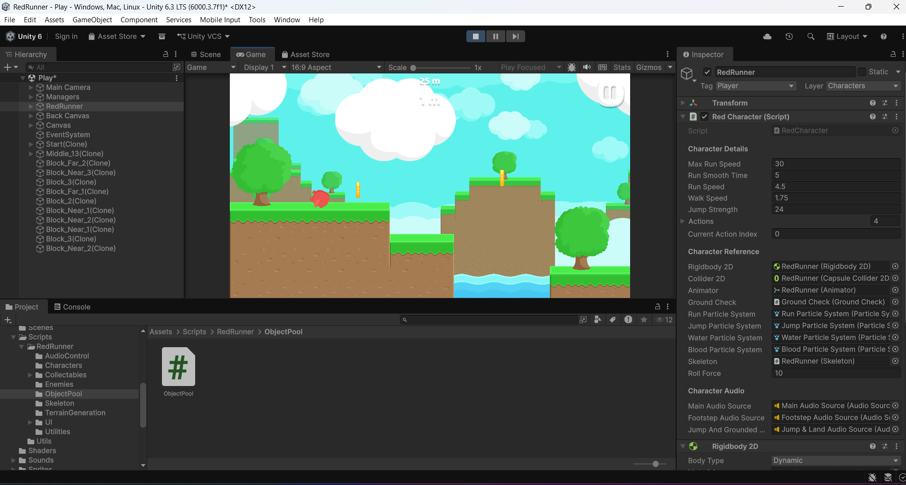

# Lab 01 - Khám phá dự án RedRunner

## Thông tin sinh viên
- **Họ tên:** Nguyễn Thị Trà My
- **MSSV:** 2312693
- **Lớp:** CTK47A

## Mô tả
Bài thực hành Lab 01 môn **Game 2D Development with Unity**.  
Khám phá và phân tích dự án game RedRunner – một Platformer 2D mã nguồn mở được phát triển bởi Bayat Games.

## Các thay đổi đã thực hiện
1. Thay đổi tốc độ chạy: 8 → 30
2. Thay đổi lực nhảy: 12 -> 24
3. Thay đổi trọng lực: 0.5 -> 3
4. Thêm Coin vào scene: thêm 2 coin

## Screenshots



## Kiến thức đã học được
1. Hiểu cấu trúc project Unity
2. Cách chỉnh thông số game trong Inspector
3. Sử dụng Git và GitHub
4. Fork và quản lý repository
5. Quản lý project Unity với Git

# Red Runner

Red Runner, Awesome Platformer Game.
# Red Runner

Red Runner, Awesome Platformer Game.

It is now free and open source and always will be. :clap: :tada:

| [:sparkles: Getting Started](#getting-started) | [:rocket: Download](#download) | [:camera: Screenshots](#screenshots) |
| --------------- | -------- | ----------- |

<p align="center">
  
</p>

[:camera: See Screenshots](#screenshots)

[:movie_camera: **See the Trailer**](https://youtu.be/MO2yJhgtMes)

## Getting Started

Follow the below instructions to get started with Red Runner source code:

1. [Make sure you have all Requirements](#requirements)
2. [Download Source Code](#download)
3. Open Project in Unity and Enjoy!

## Requirements

Make sure you have the below requirements before starting:

- [Unity Game Engine](https://unity3d.com) version **6000.2.6f2 (Unity 6)**
- Basic Knowledge about Unity and C#

## Download

You can get access to Red Runner source code by using one of the following ways:

- [:sparkles: Download Source Code](https://github.com/BayatGames/RedRunner/archive/master.zip)
- [:fire: Download Source Code from Itch.io](https://bayat.itch.io/red-runner)
- Clone the repository locally:

```bash
git clone https://github.com/BayatGames/RedRunner.git
```

Also you can the build version of the Red Runner using the following ways:

- [:star: Download from Itch.io](https://bayat.itch.io/red-runner)

## Screenshots

<p align="center">
  
</p>

<p align="center">
  
</p>

<p align="center">
  
</p>

<p align="center">
  
</p>

## Credits

- Graphics: [Free Platform Game Assets](https://bayat.itch.io/platform-game-assets)
- Save System: [Save Game Pro - Save Everything](https://bayat.itch.io/save-game-pro-save-everything)
- Game Engine: [Unity](https://unity3d.com/)
- Thanks to all of the game development community for their awesome help.

## Related

- [Awesome Unity](https://github.com/RyanNielson/awesome-unity) - A curated list of awesome Unity assets, resources, and more.
- [Games on GitHub](https://github.com/leereilly/games/) - 🎮 A list of popular/awesome videos games, add-ons, maps, etc. hosted on GitHub. Any genre. Any platform. Any engine.
- [GameDev Resources](https://github.com/Kavex/GameDev-Resources) - 🎮 🎲 A wonderful list of Game Development resources.
- [UnityLibrary](https://github.com/UnityCommunity/UnityLibrary) - 📚 Library of all kind of scripts, snippets & shaders for Unity.

## Resources

[:rocket: Patreon](https://www.patreon.com/BayatGames)

[:newspaper: Support and News](https://github.com/BayatGames/Support)

## License

MIT @ [Bayat Games](https://github.com/BayatGames)

Made with :heart: by [Bayat Games](https://github.com/BayatGames)
